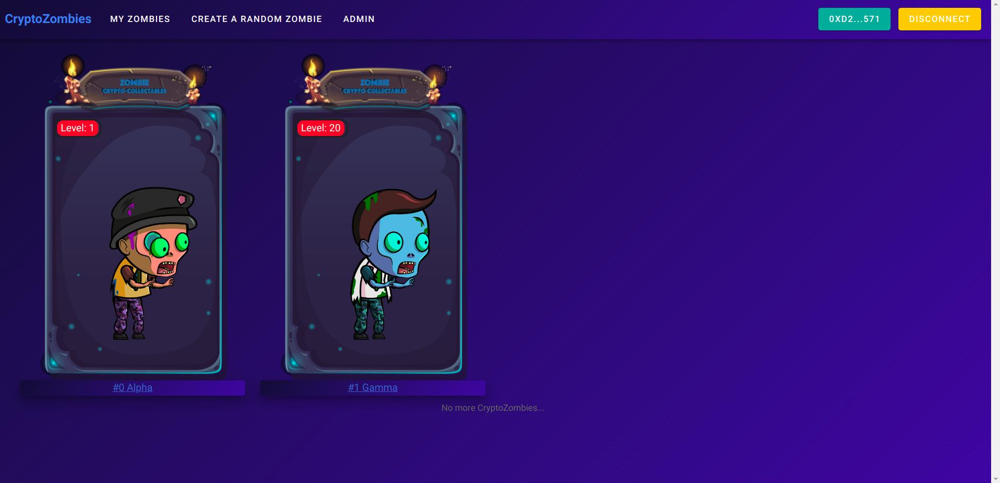

<p align="center">
  <a href="" rel="noopener">
 </a>
</p>

<h3 align="center">CryptoZombies</h3>

---

<p align="center"> CryptoZombies is a NFT based dApp which gives interface to create and collect random crypto zombies, attack other crypto zombies and also feed on crypto kitties to create mixed crypto kitty zombies.
    <br> 
</p>

## 📝 Table of Contents
- [📝 Table of Contents](#-table-of-contents)
- [Installing <a name = "installing"></a>](#installing-)
- [🚀 Deployment <a name = "deployment"></a>](#-deployment-)
- [⛏️ Built Using <a name = "built_using"></a>](#️-built-using-)
- [✍️ Authors <a name = "authors"></a>](#️-authors-)
- [🎉 Thanks <a name = "thanks"></a>](#-thanks-)


 > Note: The cryptozombies contract is currently deployed on Rinkeby Testnet.

## Installing <a name = "installing"></a>
Install the dependencies.
```
yarn install
```

And set the environment varibles.

```
ALCHEMY_API_KEY=<API_KEY>
CONTRACT_ADDRESS=<CRYPTOZOMBIES_CONTRACT_ADDRESS>
```

## 🚀 Deployment <a name = "deployment"></a>

```bash
# serve with hot reload at localhost:3000
yarn dev

# build for production and launch server
yarn build
yarn start
```

## ⛏️ Built Using <a name = "built_using"></a>

- [Solidity](https://www.mongodb.com/) - Smart Contract Programming
- [NuxtJs](https://expressjs.com/) - The Intuitive Vue Framework
- [Alchemy](https://www.alchemy.com/) - Web3 Development Tools

## ✍️ Authors <a name = "authors"></a>

- [@pawanpaudel93](https://github.com/pawanpaudel93)

See also the list of [contributors](https://github.com/pawanpaudel93/cryptozombies/contributors) who participated in this project.

## 🎉 Thanks <a name = "thanks"></a>
- [CryptoZombies](https://cryptozombies.io)
